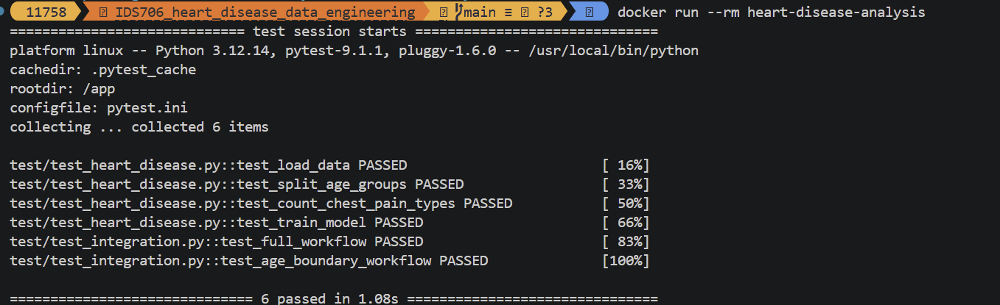

# IDS706_heart-disease-data-engineering

[](https://github.com/1175882849x-coder/IDS706_heart_disease_data_engineering/actions/workflows/tests.yml)

## Project Overview

This project is part of the IDS706 Data Engineering course. The project explores a heart disease dataset using Pandas and Polars, performs basic data filtering and grouping, creates visualizations, and uses a simple machine learning model.

The project has also been extended to improve reproducibility and reliability by organizing reusable functions, adding automated unit and integration tests, and using GitHub Actions for continuous integration.

## Project Goal

The main goals of this project are to:

- Explore and summarize the heart disease dataset
- Compare patients across age groups
- Analyze chest pain type and cholesterol patterns
- Build a simple machine learning model to predict maximum heart rate
- Compare basic Pandas and Polars performance
- Create reusable data analysis functions
- Validate the workflow with automated testing
- Automatically run tests using GitHub Actions

## Data Source

Dataset: Heart Disease UCI Dataset  
https://www.kaggle.com/datasets/navjotkaushal/heart-disease-uci-dataset

The project uses a cleaned version of the dataset with **918 rows and 10 selected variables**.

## Project Structure

```text
IDS706_heart_disease_data_engineering/
├── .github/
│   └── workflows/
│       └── tests.yml
├── data/
│   └── cleanned-selected-columns.csv
├── notebook/
│   └── previous analysis notebooks
├── src/
│   ├── __init__.py
│   └── heart_disease.py
├── test/
│   ├── test_heart_disease.py
│   └── test_integration.py
├── week_3_assignment.ipynb
├── pytest.ini
├── requirements.txt
├── README.md
└── .gitignore
```

The reusable functions for the analysis are stored in `src/heart_disease.py`, while the automated tests are organized in the `test/` directory.

## Requirements

This project requires Python 3 and the following main libraries:

- pandas
- numpy
- matplotlib
- scikit-learn
- polars
- pytest
- jupyter

## Setup

Clone the repository and install the required dependencies:

```bash
pip install -r requirements.txt
```

## Running the Analysis

The Week 3 analysis can be found in:

```text
week_3_assignment.ipynb
```

The notebook imports reusable functions from:

```text
src/heart_disease.py
```

This separates the core analysis logic from the notebook and makes the workflow easier to reuse and test.

## Data Analysis

The dataset was initially inspected using:

```python
df.head()
df.info()
df.describe()
df.isnull().sum()
df.duplicated().sum()
```

The dataset contains no missing values or duplicate rows.

The median age is **54**, so patients were divided into two groups:

```python
older_patients = df[df["age"] >= 54]
younger_patients = df[df["age"] < 54]
```

The two groups were compared using chest pain type (`cp`) and average cholesterol (`chol`).

### Average Cholesterol

- Younger patients: approximately **207.00**
- Older patients: approximately **193.84**

## Machine Learning

A Linear Regression model was used to predict maximum heart rate (`thalch`).

The input features were:

- Age (`age`)
- Resting blood pressure (`trestbps`)
- Cholesterol (`chol`)
- ST depression (`oldpeak`)

The feature and target variables were defined as:

```python
X = df[["age", "trestbps", "chol", "oldpeak"]]
y = df["thalch"]
```

The data was divided into:

- 80% training data
- 20% testing data

The model produced a Mean Squared Error of approximately:

```text
566.36
```

This model was used as an initial machine learning experiment rather than as a production prediction system.

## Visualization

The project includes:

- A boxplot comparing cholesterol distributions between younger and older patients
- A bar chart comparing average cholesterol between the two age groups
- A grouped bar chart comparing chest pain types between younger and older patients

These visualizations make differences between the two age groups easier to interpret.

## Testing

This project uses `pytest` for automated testing.

The current test suite contains **8 tests**:

### Unit Tests

The unit tests validate major components of the workflow, including:

- Data loading
- Age-group transformation
- Chest pain type grouping
- Machine learning model training and prediction

### Integration / System Tests

Integration tests validate interactions between multiple components and the end-to-end workflow.

They include:

- A full workflow test covering data loading, age grouping, chest pain analysis, model training, prediction, and evaluation
- An age-boundary test that checks the cutoff value of age 54 as an edge case

Run all tests locally with:

```bash
pytest -v
```

A successful run should report:

```text
8 passed
```

## Continuous Integration

The GitHub Actions workflow in `.github/workflows/tests.yml` automatically installs dependencies and runs the full pytest suite.

- **Triggers:** pushes to `main`, pull requests targeting `main`, a weekly schedule on Mondays at 12:00 UTC, and manual runs through the Actions tab.
- **Test matrix:** Python 3.11 and 3.12 on Ubuntu.
- **Test coverage:** unit and integration tests covering data loading, age grouping, chest pain counts, model training, and the age-54 boundary case.
- **Verification:** both Python matrix jobs passed successfully after the workflow update.

The CI status badge at the top of this README links to the workflow and displays its current status.


## Docker

Install and start Docker Desktop, then run these commands from the project root:

```bash
docker build -t heart-disease-analysis .
docker run --rm heart-disease-analysis
```

The image includes Python 3.12, project dependencies, source code, data, and tests. Its default command runs the pytest suite, including the integration test for data loading, grouping, model training, and evaluation.

The image built successfully, and all six tests passed inside the Linux container. The container exits after testing; `--rm` removes the container while preserving the image.

This exercise demonstrated how a Dockerfile packages a project environment and how an image is used to create a runnable container.




## Refactoring and Code Quality

Model feature and target column names are now defined in `FEATURE_COLUMNS` and `TARGET_COLUMN`. Data selection was extracted from `train_model()` into `prepare_model_data()`, which also raises a clear error when required columns are missing.

This separates data preparation from model training and makes the column-selection logic independently testable. The existing return values of `train_model()` were preserved for notebook compatibility.

Two tests were added to verify correct feature and target selection and the error raised for a missing required column. All eight tests passed locally after refactoring. Black checks formatting, and flake8 checks code quality; both checks are included in the CI workflow.


## Using Polars

Pandas and Polars were compared by reading the same CSV file and performing similar basic data operations.

For this dataset:

- Polars loaded the CSV in approximately **0.1 seconds**
- Pandas loaded the CSV in approximately **0.3 seconds**

Polars was faster for file reading in this experiment.

However, the dataset contains only 918 rows, so the overall performance difference is relatively small. Pandas and Polars also display results differently, with Polars using a more structured table-style format.

## Outcomes

The main outcomes of the project are:

- The dataset contains **918 observations and 10 selected variables**
- There are no missing values or duplicate rows
- The median age is **54**
- Younger patients had slightly higher average cholesterol in this dataset
- Older patients had more asymptomatic chest pain cases
- A Linear Regression model was successfully used as an initial machine learning experiment
- Core analysis logic was reorganized into reusable Python functions
- Four unit tests validate the major functions
- Two integration tests validate the workflow and an important age-boundary edge case
- All eight tests pass successfully
- GitHub Actions automatically runs the tests after code changes

## Reproducibility

The project improves reproducibility by providing:

- A `requirements.txt` file for dependency installation
- Reusable source code in `src/`
- Automated tests using pytest
- Integration testing for the full workflow
- GitHub Actions continuous integration
- Clear instructions for running the analysis and tests

## Screenshots


