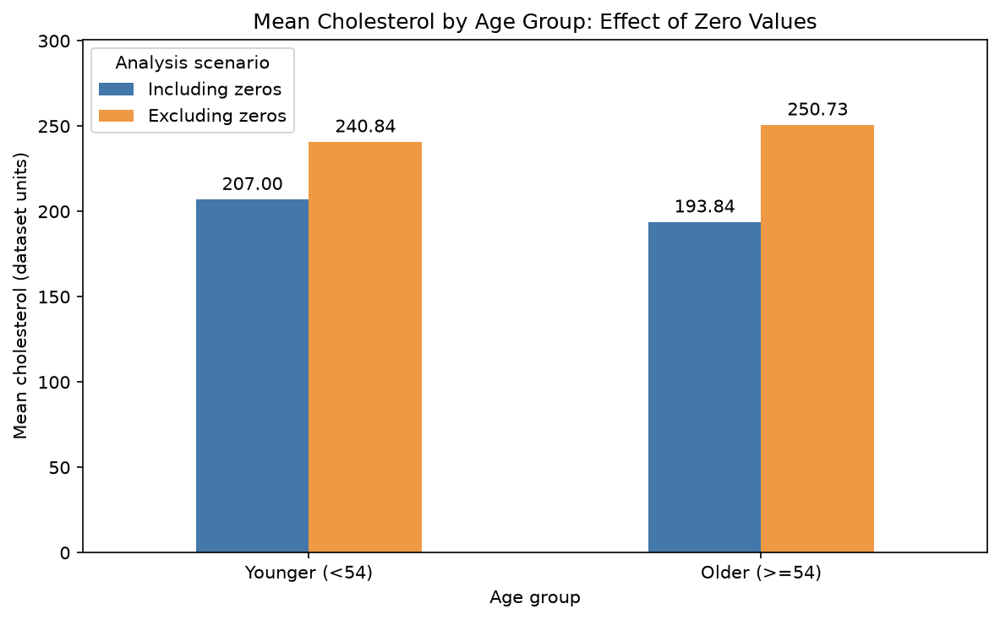
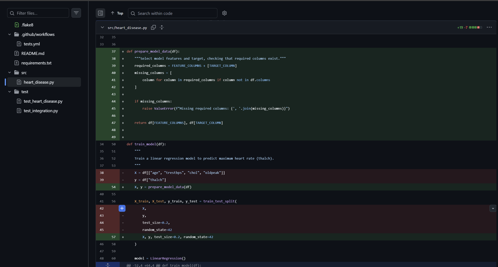

# Heart Disease Data Analysis and Engineering

[](https://github.com/1175882849x-coder/IDS706_heart_disease_data_engineering/actions/workflows/tests.yml)

## Project Purpose

This IDS706 project investigates how cholesterol patterns differ between age groups and how data-quality decisions affect the findings. It also explores chest pain patterns and uses linear regression to predict maximum heart rate.

The engineering workflow includes reusable Python functions, automated tests, GitHub Actions, code-quality checks, and Docker.

## Data and Cleaning Decisions

Source: [Heart Disease UCI Dataset on Kaggle](https://www.kaggle.com/datasets/navjotkaushal/heart-disease-uci-dataset).

The supplied CSV, `data/cleanned-selected-columns.csv`, contains **918 records and 10 selected variables**. It has no explicit missing values or duplicate rows, but **172 records (18.74%) contain zero cholesterol**.

For this project:

- Zero cholesterol is treated as an unavailable measurement. Its exact origin has not been confirmed.
- The main cholesterol analysis and regression model exclude these records, using **746 records**.
- Age and chest pain analyses retain all **918 records**.
- The original CSV and loaded DataFrame are preserved.
- Among nonzero cholesterol values, **23 records** fall outside the 1.5 × IQR bounds of **115–371**. They are flagged but retained because statistical extremes are not necessarily errors.

## Key Findings

Patients are grouped using the original dataset's median age of **54**.

| Measure | Younger (<54) | Older (≥54) |
|---|---:|---:|
| Total records | 420 | 498 |
| Zero cholesterol records | 59 (14.05%) | 113 (22.69%) |
| Nonzero cholesterol records | 361 | 385 |
| Mean including zeros | 207.00 | 193.84 |
| Mean excluding zeros | 240.84 | 250.73 |
| Median excluding zeros | 231.00 | 242.00 |

**The age-group comparison reverses after excluding zero cholesterol values.** This sensitivity analysis extends the original group comparison by examining how a data-cleaning decision changes the conclusion.

Because zero values occur more frequently in the older group, excluding them may introduce selection bias. The main cholesterol findings describe the nonzero subset and may not represent all patients.



## Model Results

Linear regression predicts maximum heart rate (`thalch`) from `age`, `trestbps`, `chol`, and `oldpeak`.

Zero cholesterol records are excluded before the 80%/20% train-test split, using `random_state=42`.

| Metric | Result |
|---|---:|
| Modeling records | 746 |
| Training records | 596 |
| Test records | 150 |
| Mean Squared Error | 372.20 |
| Root Mean Squared Error | 19.29 |

These results cannot be directly compared with the earlier MSE of 566.36 as evidence of improvement because filtering changed the sample and test set. The model is exploratory and has not been validated for clinical use.

## Setup and Analysis

Python 3.11 or 3.12 is recommended to match the CI matrix.

```bash
git clone https://github.com/1175882849x-coder/IDS706_heart_disease_data_engineering.git
cd IDS706_heart_disease_data_engineering
python -m pip install -r requirements.txt
```

To run the notebook with JupyterLab:

```bash
python -m pip install jupyterlab
python -m jupyterlab
```

Open `week_3_assignment.ipynb`, restart the kernel, and run all cells in order. Alternatively, use VS Code's notebook support and select the Python environment containing the dependencies.

The notebook produces data-quality checks, the sensitivity comparison and chart, outlier counts, age and chest pain summaries, and model results. The chart is saved to `docs/images/cholesterol-sensitivity.png`.

## Tests and Code Quality

```bash
python -m pytest -v
python -m black --check src test
python -m flake8 src test
```

The current suite contains **11 test cases**, covering:

- Data loading, age grouping, chest pain counts, and model training.
- Correct feature and target selection.
- Missing required columns.
- Zero cholesterol filtering, feature-target alignment, and preservation of the input data.
- All-zero cholesterol and insufficient records after filtering.
- An integrated workflow and the age-54 boundary.

All **11 tests passed locally and inside Docker**. Black checks formatting, while flake8 uses the settings in `.flake8`.

## Continuous Integration

The workflow in `.github/workflows/tests.yml` installs dependencies, checks formatting, runs flake8, and executes the test suite.

- **Matrix:** Python 3.11 and 3.12 on Ubuntu.
- **Triggers:** pushes to `main`, pull requests targeting `main`, Mondays at 12:00 UTC, and manual runs.
- **Status:** the badge at the top links to the workflow's current results.

## Docker

Start Docker Desktop and run these commands from the project root:

```bash
docker build -t heart-disease-analysis .
docker run --rm heart-disease-analysis
```

The image packages Python 3.12, dependencies, source code, data, and tests. Its default command runs pytest, including the integrated data-processing and model-training workflow. It does not execute the notebook or generate its chart.

The image built successfully, and **all 11 tests passed inside the Linux container**. The container exits after testing; `--rm` removes the container while preserving the image.

This exercise demonstrated the difference between an image and a running container, dependency installation during builds, and reuse of cached build steps. `.dockerignore` excludes unnecessary local files from the build context.


## Refactoring

Feature and target names were centralized in `FEATURE_COLUMNS` and `TARGET_COLUMN`. Data preparation was extracted from `train_model()` into `prepare_model_data()`.

The helper checks required columns, excludes zero cholesterol records, and requires at least five remaining records. This threshold is an operational guard for the current split, not a claim that five records are sufficient for reliable modeling.

The refactoring separates data preparation from training while preserving the return values of `train_model()`. Tests verify the filtering behavior and error handling. The notebook was also restarted and run from beginning to end.



## Project Files

- `week_3_assignment.ipynb`: main analysis and results.
- `src/heart_disease.py`: reusable data-processing and model functions.
- `test/`: automated tests.
- `data/`: supplied dataset.
- `notebook/`: earlier analysis notebooks.
- `.github/workflows/tests.yml`: CI configuration.
- `Dockerfile` and `.dockerignore`: container configuration.
- `requirements.txt` and `.flake8`: dependencies and lint settings.
- `docs/images/`: analysis figure and verification screenshots.